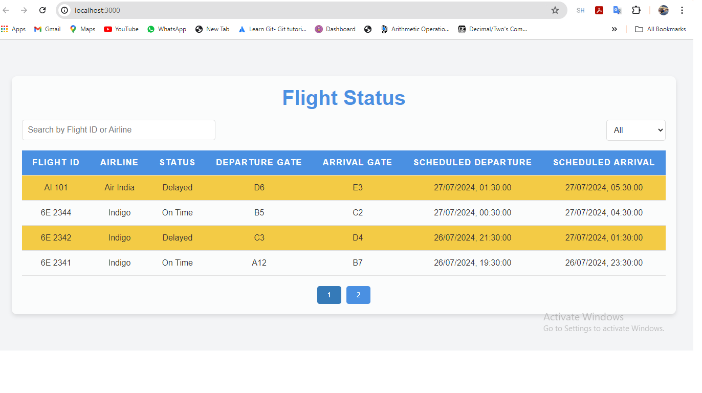
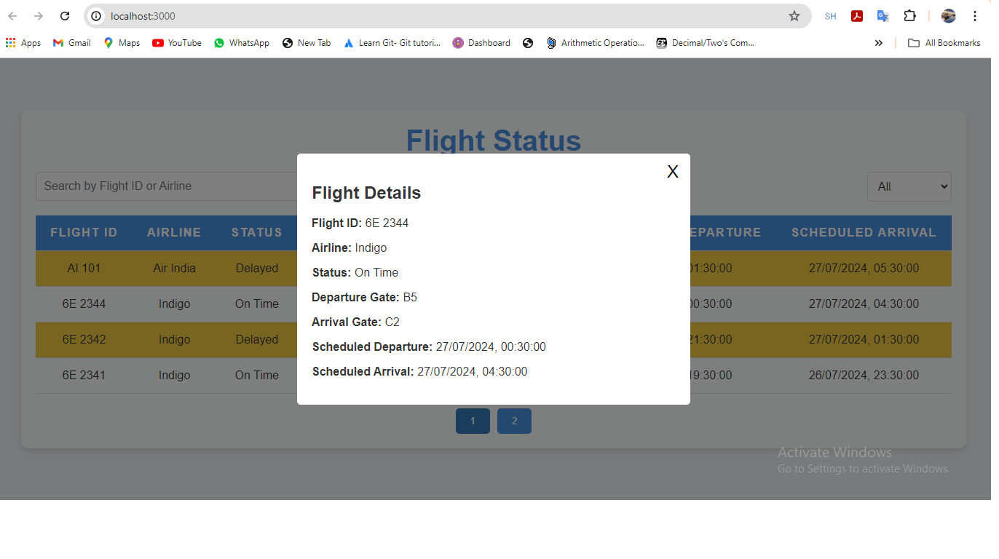

# Indigohack-frontend

# Flight Status Tracker

## Overview
Flight Status Tracker an ReactJS application designed to help users track the status of flights. The application displays flight details, allows users to search and filter flights, sort them by different criteria, and view detailed information in a modal.

## Features
- Display a list of flights with details such as Flight ID, Airline, Status, Departure Gate, Arrival Gate, Scheduled Departure, and Scheduled Arrival.
- Search functionality to filter flights by Flight ID or Airline.
- Filter flights by status (All, On-time, Delayed, Cancelled).
- Sort flights by Flight ID, Airline, Status, Departure Gate, Arrival Gate, Scheduled Departure, and Scheduled Arrival.
- Paginated flight list for easy navigation.
- Click on a flight row to view detailed information in a modal.

## Screenshots

### Main Interface

The main interface displays a list of flights with search and filter options.

### Flight Details Modal

Clicking on a flight row opens a modal with detailed information about the selected flight.

## Installation
1. Clone the repository:
    ```sh
    git clone https://github.com/yourusername/flight-status-tracker.git
    ```
2. Navigate to the project directory:
    ```sh
    cd flight-status-tracker
    ```
3. Install dependencies:
    ```sh
    npm install
    ```
4. Start the development server:
    ```sh
    npm start
    ```
5. Open your browser and navigate to `http://localhost:3000`.
